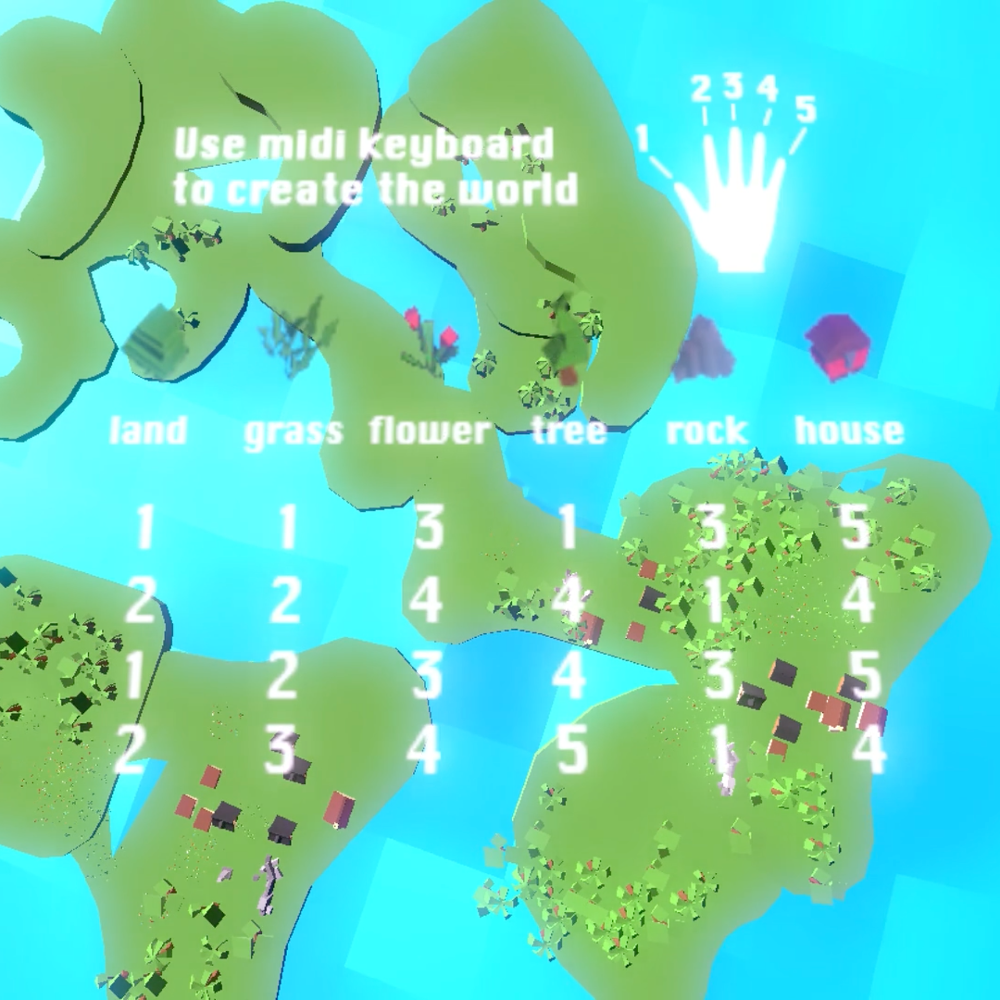
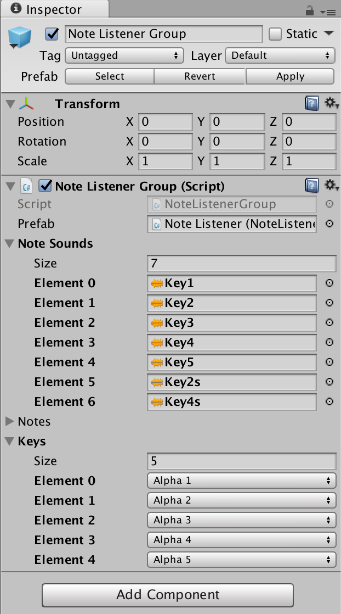
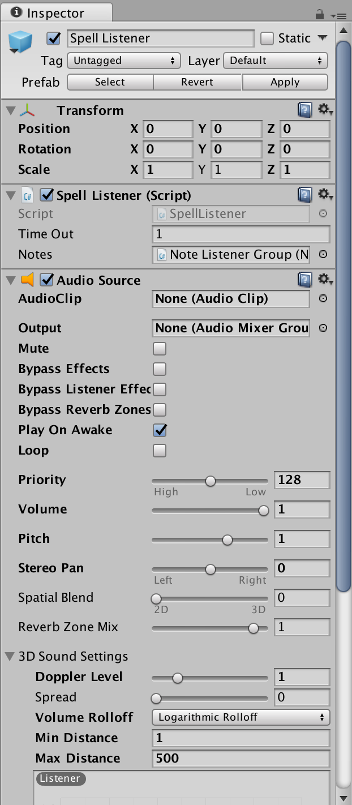

# Melody Painter

## Intro:
This is a series of class written for melody painter project.
Project Link: http://www.sunwangshu.com/portfolio/melody-painter/

## Classes:
**ExampleIndicators.cs**: An example interface to show the usage.

**Note Listeners**: Listen if key1 - key5 is pressed or not, and playing sound effects.

**Note Listener Group**: A class that keeps a reference of all five keys and change their sound effects if needed.

**Spell Listener**: Check if the keys played in sequence match some specific patterns, clean up the input buffer when timeout.

For example:

Input: 3 5 2 1 2 4 3 4 3 4
Buffer: [3 4 3 4]
Output: Flower (Spell)

## Class Hierarchy:
Spell Listener <- Note Listener Group <- Note Listeners.

Class Hierarchy:

Note Listener Group:

Spell Listener:

